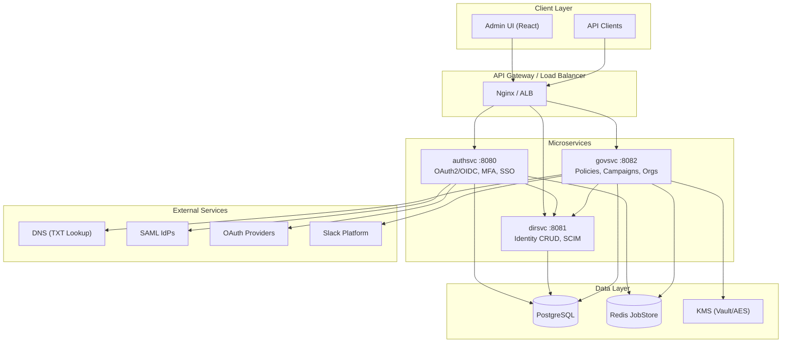
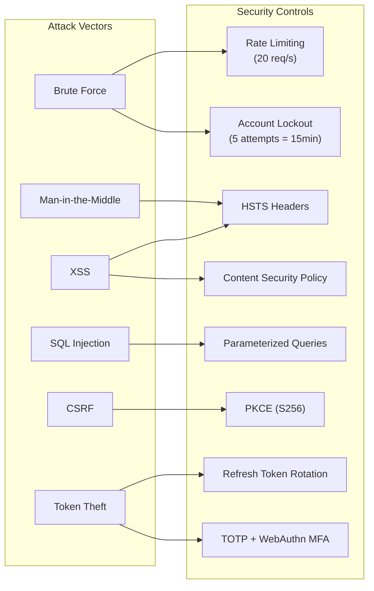
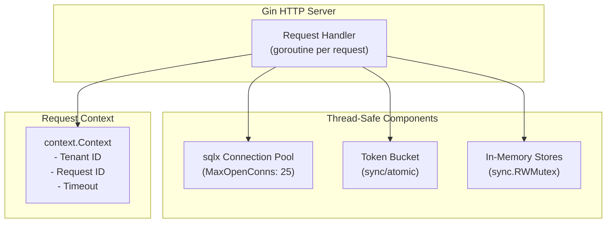
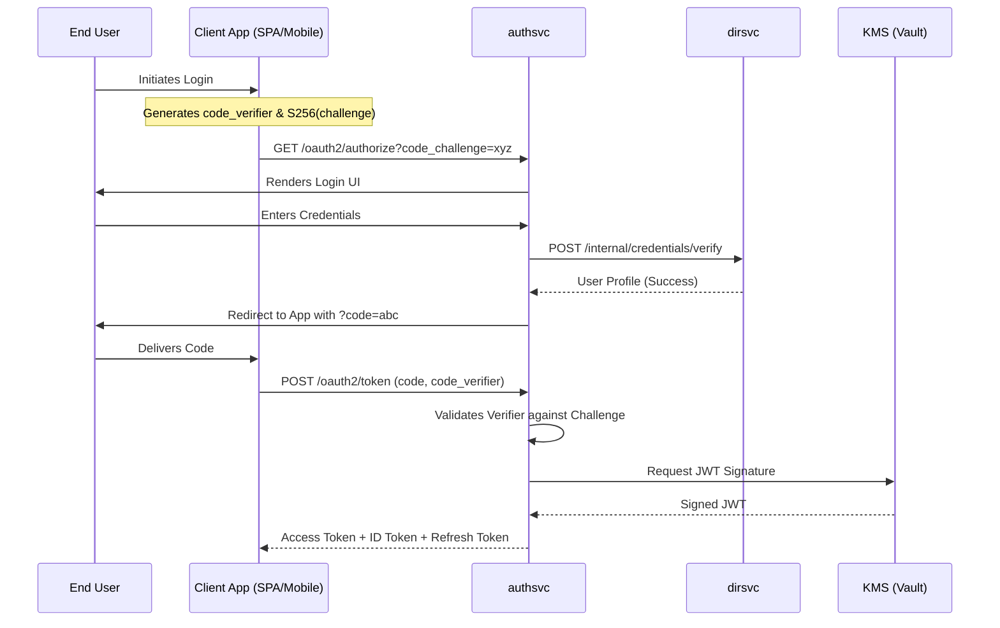
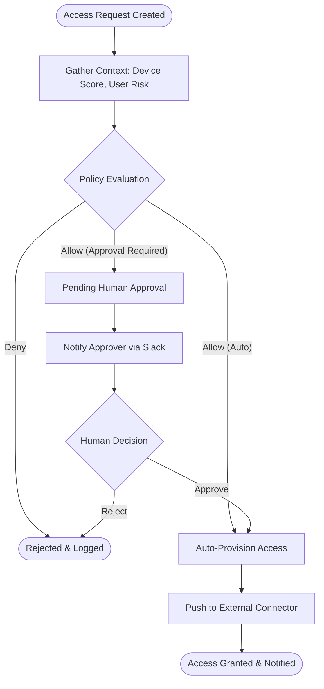

# WardSeal Architecture Documentation

## 1. Data Model (ER Diagram)

```mermaid
erDiagram
    TENANTS ||--o{ IDENTITIES : has
    TENANTS ||--o{ ORGANIZATIONS : has
    TENANTS ||--o{ OAUTH_CLIENTS : has
    TENANTS ||--o{ SAML_PROVIDERS : has
    TENANTS ||--o{ WEBHOOKS : has
    TENANTS ||--o{ CHATOPS_SLACK_INTEGRATIONS : has
    TENANTS ||--o{ POLICIES : has
    
    IDENTITIES ||--o{ WEBAUTHN_CREDENTIALS : has
    IDENTITIES ||--o{ TOTP_SECRETS : has
    IDENTITIES ||--o{ DEVICES : uses
    IDENTITIES ||--o{ REFRESH_TOKENS : has
    
    ORGANIZATIONS ||--o{ IDENTITIES : contains
    
    TENANTS {
        uuid id PK
        string name
        string domain
        jsonb settings
        timestamp created_at
    }
    
    IDENTITIES {
        uuid id PK
        uuid tenant_id FK
        string email
        string password_hash
        string status
        jsonb profile
        timestamp created_at
    }
    
    ORGANIZATIONS {
        uuid id PK
        uuid tenant_id FK
        string name
        string domain
        boolean domain_verified
        string verification_token
        timestamp created_at
    }
    
    OAUTH_CLIENTS {
        uuid id PK
        uuid tenant_id FK
        string client_id
        string client_secret
        jsonb redirect_uris
        jsonb grant_types
    }
    
    TOTP_SECRETS {
        uuid id PK
        uuid identity_id FK
        string secret
        boolean verified
        timestamp created_at
    }
    
    WEBAUTHN_CREDENTIALS {
        uuid id PK
        uuid identity_id FK
        bytes credential_id
        bytes public_key
        string aaguid
    }
    
    DEVICES {
        uuid id PK
        uuid identity_id FK
        string fingerprint
        jsonb posture
        string trust_level
    }
    
    REFRESH_TOKENS {
        uuid id PK
        string token
        uuid tenant_id
        string client_id
        timestamp expires_at
    }
    
    AUTHORIZATION_CODES {
        uuid id PK
        string code
        string client_id
        string code_challenge
        timestamp expires_at
    }
    
    LOGIN_ATTEMPTS {
        uuid id PK
        uuid tenant_id FK
        string username
        string ip_address
        boolean success
        timestamp attempted_at
    }
    
    ACCOUNT_LOCKOUTS {
        uuid id PK
        uuid tenant_id FK
        string username
        timestamp locked_until
    }

    CHATOPS_SLACK_INTEGRATIONS {
        uuid id PK
        uuid tenant_id FK
        string team_id
        bytes bot_token // Encrypted
        bytes signing_secret // Encrypted
        boolean is_enabled
    }

    POLICIES {
        uuid id PK
        uuid tenant_id FK
        string name
        string rule_type // simple, cel, rego
        jsonb rule_data
        boolean is_enabled
    }
    
    AUDIT_LOGS {
        uuid id PK
        uuid tenant_id FK
        string actor
        string action
        jsonb details
        timestamp created_at
    }
```

---

## 2. Service Architecture



### Service Responsibilities

| Service | Port | Responsibilities |
|---------|------|------------------|
| **authsvc** | 8080 | OAuth2/OIDC, Login, MFA (TOTP, WebAuthn), SAML SSO, Tokens |
| **dirsvc** | 8081 | Identity CRUD, Password validation, SCIM 2.0 provisioning |
| **govsvc** | 8082 | Access Requests, Policies, Organizations, Discovery Jobs, ChatOps Integrations |

---

## 3. Threat Model



### Security Controls Summary

| Threat | Control | Implementation |
|--------|---------|----------------|
| Brute Force | Rate Limiting | `middleware.RateLimitMiddleware(20, 40)` |
| Brute Force | Account Lockout | `login_attempt_store.go` - 5 failures = 15min lock |
| CSRF | PKCE | S256 code challenge in OAuth2 flow |
| XSS | Security Headers | `SecurityHeadersMiddleware()` - CSP, X-Frame-Options |
| SQL Injection | Parameterized Queries | `sqlx` with `$1, $2` placeholders |
| Token Theft | MFA | TOTP + WebAuthn enforcement |
| Token Theft | Rotation | Refresh tokens rotated on use |
| Secret Theft | KMS | AES-256-GCM field-level encryption for sensitive tokens |
| Slack Spoofing | Signatures | HMAC-SHA256 verification on all incoming callbacks |
| Session Hijack | Device Binding | Device fingerprint + trust scoring |

---

## 4. Concurrency Model



### Concurrency Patterns

| Component | Pattern | Details |
|-----------|---------|---------|
| **HTTP Server** | Goroutine per request | Gin spawns goroutine for each incoming request |
| **Database** | Connection Pool | `sqlx.DB` manages pool (default 25 open, 10 idle) |
| **Rate Limiter** | Token Bucket | `golang.org/x/time/rate` - atomic operations |
| **In-Memory Stores** | RWMutex | `sync.RWMutex` for maps (codes, tokens, revocations) |
| **Context** | Deadline Propagation | `context.Context` with timeout passed to all stores |
| **Background Jobs** | N/A | No background workers currently (migrations sync) |

### Thread Safety

```go
// In-memory store example (service.go)
type authorizationCodeStore struct {
    mu    sync.RWMutex  // Reader-writer lock
    codes map[string]authorizationCode
}

func (s *authorizationCodeStore) Get(ctx context.Context, code string) (authorizationCode, bool, error) {
    s.mu.RLock()         // Multiple readers OK
    defer s.mu.RUnlock()
    c, ok := s.codes[code]
    return c, ok, nil
}

func (s *authorizationCodeStore) Save(ctx context.Context, code authorizationCode) error {
    s.mu.Lock()          // Exclusive write lock
    defer s.mu.Unlock()
    s.codes[code.Code] = code
    return nil
}
```

---

## 5. Multi-Tenant Integration Model

WardSeal uses a **Dynamic Tenant Resolution** model for all third-party integrations (Slack, Connectors).

1.  **Stateless Callbacks**: Incoming Slack events contain a `team_id`.
2.  **Context Resolution**: The `chatops.Repository` lookups the `SigningSecret` for that `team_id`.
3.  **Cryptographic Isolation**: All per-tenant secrets are stored in the database, encrypted using a tenant-agnostic `WARDSEAL_MASTER_KEY` or a Vault-managed key.

## 6. Tiered Policy Engine

The governance layer supports three levels of policy sophistication:

| Tier | Language | Best For | Implementation |
|---|---|---|---|
| **Simple** | JSON/YAML | Attribute-based access (MFA, Geo, Device) | `SimpleEvaluator` |
| **Advanced** | CEL | Complex boolean logic (Google CEL) | `CELEvaluator` |
| **Enterprise** | Rego | Full RBAC/ABAC compliance logic | `RegoEvaluator` (Coming Soon) |

---

## 7. SOLID Principles in WardSeal

WardSeal is built with long-term maintainability in mind, strictly following the **SOLID** design principles:

### Single Responsibility Principle (SRP)
Each package and service has one focused reason to change.
- **`internal/auth`**: Focused solely on identity validation and token lifecycles.
- **`pkg/kms`**: Dedicated to cryptographic primitives, isolated from business logic.
- **`internal/directory`**: Centralized authority for user profiles and memberships.

### Open/Closed Principle (OCP)
The system is open for extension but closed for modification.
- **LLM Integration**: The `llm.Provider` interface allows adding new providers (OpenRouter, Gemini) without changing the `governance` service code.
- **Connectors**: The `connector.Registry` allows dynamic registration of new third-party systems (Google, AzureAD, Slack) at runtime.

### Liskov Substitution Principle (LSP)
Subtypes are interchangeable without affecting program correctness.
- **Storage Backends**: All repository interfaces (e.g., `AuthorizationCodeRepository`) have interchangeable SQL and In-Memory implementations.
- **Connectors**: Any implementation of the `Connector` interface can be used by the provisioning engine regardless of the underlying platform.

### Interface Segregation Principle (ISP)
Clients should not be forced to depend on methods they do not use.
- **KMS**: Divided into `Signer`, `Cipher`, and `KeyManager` interfaces so consumers only request the specific capability they need.
- **Auth Repositories**: Individual stores for TOTP, WebAuthn, and Sessions prevent a "god-object" repository pattern.

### Dependency Inversion Principle (DIP)
High-level modules depend on abstractions, not concrete implementations.
- **Service Factories**: Services are instantiated via `NewService` functions that accept interfaces, enabling easy dependency injection and testing.
- **Provider Pattern**: The `governance` service consumes a `DirectoryClient` interface, allowing it to communicate with a remote service or a local mock during testing.

---

## 8. Detailed Flows

### OAuth2 Authorization Code Flow with PKCE


### Access Request Lifecycle (Zero Trust)


### LLM-Powered Governance Discovery
```mermaid
flowchart LR
    Trigger[Scheduled Job] --> Fetch[Fetch Raw Config/Metadata]
    Fetch --> LLM[LLM Provider (OpenRouter)]
    LLM --> Analyze{Analysis}
    Analyze --> Classify[Classify: Sensitive? Shadow AI?]
    Classify --> Store[Store Discovered Resource]
    Store --> Audit[Generate Compliance Report]
```

---

## 9. ReBAC Authorization Engine

WardSeal includes a high-performance Relationship-Based Access Control (ReBAC) evaluation engine inspired by Google's Zanzibar paper.

### Traversal & Userset Evaluation

Permissions are modeled as an entity graph. When evaluating permissions:
1. **Direct Check**: Resolves explicit `(namespace:object)#relation@subject` mappings.
2. **Set Indirection**: Discovers indirect assignments via nested groups.

### Caching Layer
To prevent deep recursive graph lookups from bottlenecking standard authentication pipelines, authorization decisions are aggressively stored in a `sync.Map` invalidated by specific tuple updates.

---

## Quick Reference


| Metric | Value |
|--------|-------|
| Services | 3 (authsvc, dirsvc, govsvc) |
| Database Tables | 22+ |
| API Endpoints | 60+ |
| Cryptography | AES-256-GCM, HMAC-SHA256, RSA-4096 |
| Policy Engines | SimpleABAC, CEL |
| Rate Limit | 20 req/s per IP |
| Lockout Threshold | 5 failed attempts |
| Token Expiry | Access: 1h, Refresh: 7d |

