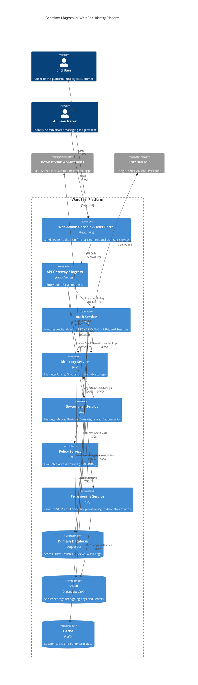

# System Architecture

The following diagram illustrates the high-level architecture of the WardSeal platform using the C4 Container model.

## Service Interactions

1.  **Authentication Flow**:
    *   User accesses **Web App**, redirects to **Auth Service**.
    *   **Auth Service** verifies credentials against **Directory Service** (or External IdP).
    *   **Auth Service** checks **Policy Service** for login policies (e.g. MFA requirements).
    *   On success, **Auth Service** mints tokens signed by keys in **Vault**.

2.  **Governance Flow**:
    *   **Governance Service** initiates a Campaign.
    *   Reads reviewers and targets from **Directory Service**.
    *   When access is revoked, **Governance Service** calls **Provisioning Service** to deprovision access in downstream **Apps**.
